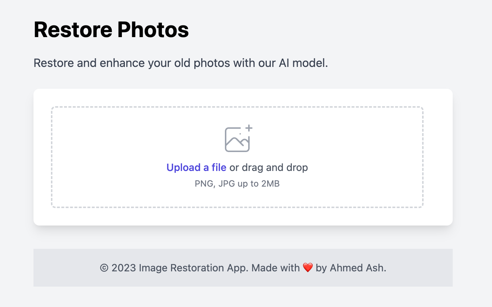
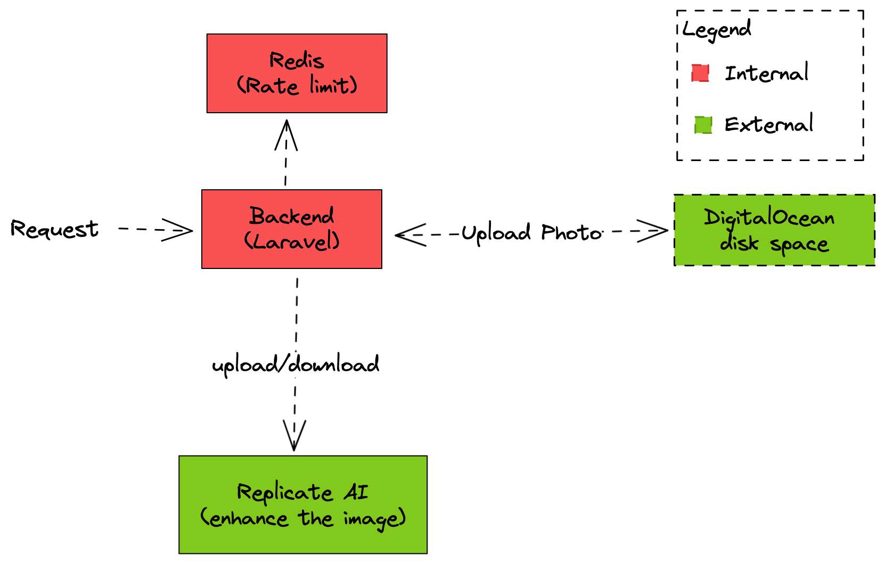

# Image Restoration app

Uses Replicate's [Image Restoration](https://replicate.com/collections/image-restoration) model to restore and enhance images.

### Stack

- Laravel
- Alpine.js
- Tailwind CSS
- Redis for rate limiting
- DigitalOcean spaces for storage

### Packages and libraries
- [Axios](https://axios-http.com/) for HTTP requests
- [Saloon](https://docs.saloon.dev/) for api calls

### Architecture

The user sends a request to the web server with a desired image. The web server will then call our API server, which will upload the image to DigitalOcean spaces and return a URL. Next, we send this URL to Replicate's API for processing and receive the processed image URL in return. We then download the processed image from the URL, save it to DigitalOcean spaces, and return the final URL to the web server. Finally, the web server returns the processed image URL to the user.

The reason behind uploading photos to DigitalOcean spaces is to prevent sending a malicious images to Replicate. also to avoid any extra costs from Replicate if we returned their urls directly to the users.

### Installation

You need to have Replicate's API key and DigitalOcean spaces credentials to run this app.

- Clone the repo
- Run `composer install`
- Run `php artisan serve`
